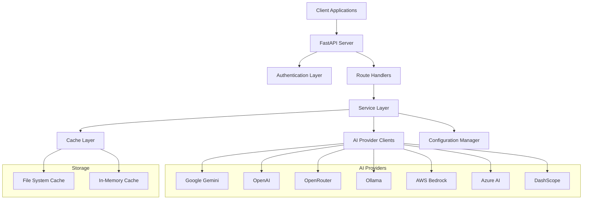
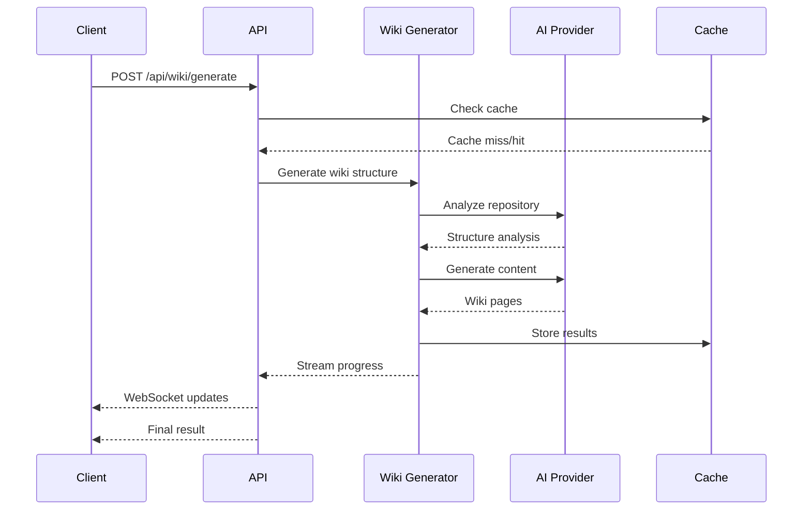
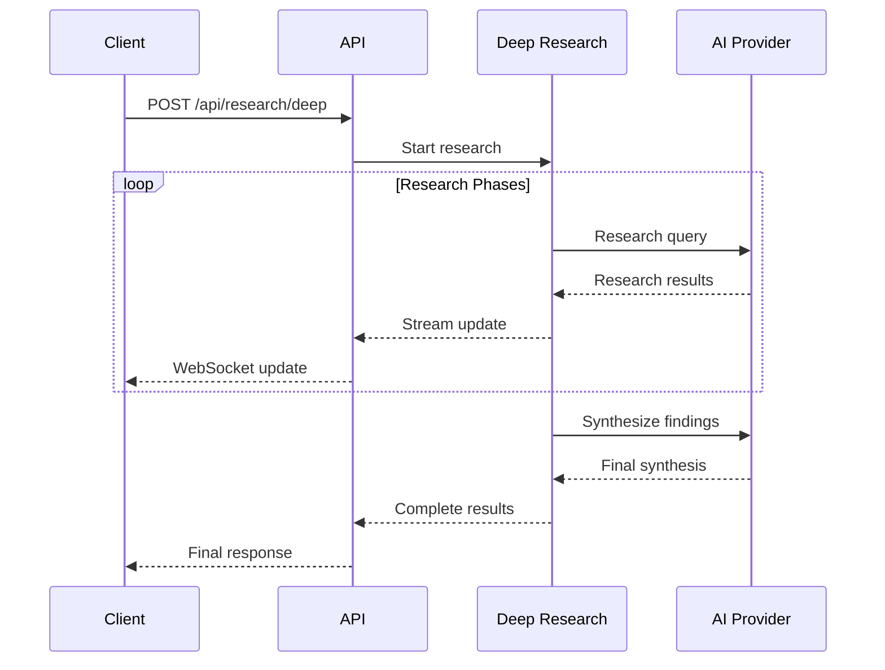
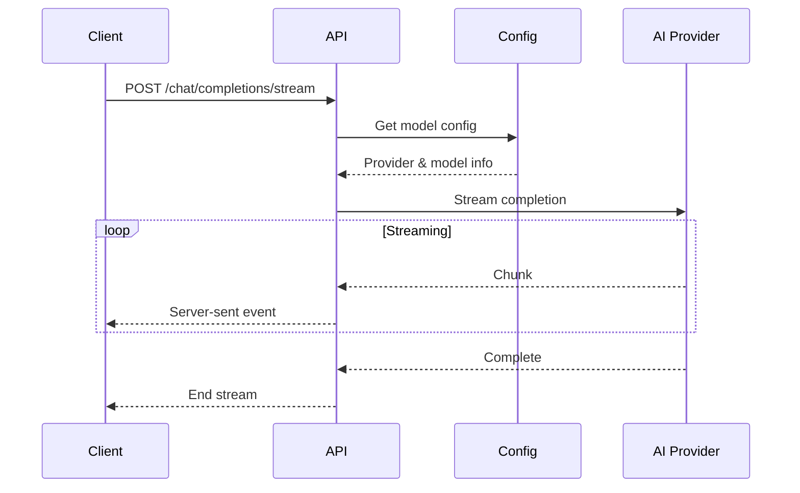

# Grantha Architecture Documentation

## System Overview

Grantha is designed as a modular, scalable AI-powered knowledge management system with a clean separation of concerns. The architecture supports multiple AI providers, real-time streaming, and intelligent caching.

## High-Level Architecture



## Core Components

### 1. API Layer (`api/api.py`)

The API layer is built on FastAPI and provides:
- RESTful endpoints for all operations
- WebSocket support for real-time streaming
- CORS middleware for cross-origin requests
- Automatic API documentation
- Request/response validation with Pydantic models

**Key Features:**
- Async/await support for high concurrency
- Streaming responses for long-running operations
- Comprehensive error handling
- OpenAPI specification generation

### 2. Configuration Management (`api/config.py`)

Centralized configuration system that handles:
- Environment variable management
- JSON configuration file loading
- Provider and model configuration
- Dynamic client instantiation
- Configuration validation and defaults

**Configuration Files:**
- `generator.json` - LLM providers and models
- `embedder.json` - Embedding configurations
- `repo.json` - Repository analysis settings
- `lang.json` - Multi-language support

### 3. AI Provider Clients

Abstracted client layer supporting multiple AI providers:

#### Client Architecture
```python
# Base client interface pattern
class BaseClient:
    async def complete(self, messages, **kwargs):
        """Generate completions"""
        pass
    
    async def embed(self, text, **kwargs):
        """Generate embeddings"""
        pass
```

#### Supported Providers
- **GoogleGenAIClient** (`adalflow.GoogleGenAIClient`) - Google Gemini
- **OpenAIClient** (`api/openai_client.py`) - OpenAI GPT models
- **OpenRouterClient** (`api/openrouter_client.py`) - Unified model access
- **OllamaClient** (`adalflow.OllamaClient`) - Local model serving
- **BedrockClient** (`api/bedrock_client.py`) - AWS Bedrock
- **AzureAIClient** (`api/azureai_client.py`) - Azure OpenAI
- **DashscopeClient** (`api/dashscope_client.py`) - Alibaba Cloud

### 4. Service Layer

#### Wiki Generation Service (`api/wiki_generator.py`)
Responsible for:
- Repository analysis and structure extraction
- Content generation using LLMs
- Wiki page organization and linking
- Progress tracking and streaming updates

#### Deep Research Service (`api/deep_research.py`)
Provides:
- Multi-step research workflows
- Context accumulation across research phases
- Streaming research results
- Knowledge synthesis and analysis

#### RAG Service (`api/rag.py`)
Implements:
- Document embedding and indexing
- Semantic search capabilities
- Context retrieval for enhanced responses
- Vector database integration

### 5. Cache Layer

Multi-level caching system:

#### File System Cache
- Persistent wiki structure storage
- Research result caching
- Configuration caching
- Path: `~/.adalflow/wiki_cache/`

#### In-Memory Cache
- Model configuration caching
- Session state management
- Temporary data storage

## Data Flow Architecture

### 1. Wiki Generation Flow



### 2. Deep Research Flow



### 3. Chat Completion Flow



## Security Architecture

### Authentication System
- Optional authentication mode via environment variables
- Token-based authentication for sensitive operations
- Configurable authentication codes
- CORS protection for web applications

### Input Validation
- Pydantic models for all API inputs
- Type checking and validation
- Sanitization of file paths and user inputs
- Rate limiting considerations

### Environment Security
- Secure environment variable handling
- API key encryption and storage
- No hardcoded secrets in codebase
- Configuration file security

## Scalability Considerations

### Horizontal Scaling
- Stateless API design enables multiple instances
- Shared cache layer for consistency
- Load balancer compatibility
- Database-agnostic design

### Performance Optimizations
- Async/await throughout the codebase
- Streaming responses for long operations
- Intelligent caching strategies
- Connection pooling for AI providers

### Resource Management
- Memory-efficient streaming
- Configurable timeout values
- Resource cleanup and garbage collection
- Error recovery mechanisms

## Configuration Architecture

### Environment-Based Configuration
```python
# Configuration precedence:
# 1. Environment variables
# 2. Configuration files
# 3. Default values

GOOGLE_API_KEY = os.environ.get('GOOGLE_API_KEY')
config = load_json_config("generator.json")
```

### Dynamic Provider Loading
```python
# Providers loaded dynamically based on configuration
CLIENT_CLASSES = {
    "GoogleGenAIClient": GoogleGenAIClient,
    "OpenAIClient": OpenAIClient,
    # ...
}

def get_model_config(provider="google", model=None):
    provider_config = configs["providers"].get(provider)
    model_client = provider_config.get("model_client")
    return {"model_client": model_client, "model_kwargs": {...}}
```

## Error Handling Architecture

### Exception Hierarchy
- Custom exception classes for different error types
- Graceful degradation on provider failures
- Comprehensive logging and monitoring
- Client-friendly error responses

### Retry Logic
- Exponential backoff for API failures
- Provider failover mechanisms
- Timeout handling
- Circuit breaker patterns

## Monitoring and Observability

### Logging System (`api/logging_config.py`)
- Structured logging with JSON format
- Configurable log levels
- Request/response logging
- Performance metrics

### Health Monitoring
- `/health` endpoint for system status
- Provider availability checking
- Resource utilization monitoring
- Error rate tracking

## Extension Points

### Adding New AI Providers
1. Create client class implementing base interface
2. Add to `CLIENT_CLASSES` mapping
3. Update configuration files
4. Add provider-specific error handling

### Custom Services
1. Implement service interface
2. Register with dependency injection
3. Add route handlers
4. Update documentation

### Plugin Architecture
- Modular design supports plugin development
- Clear interface definitions
- Configuration-driven feature enablement
- Runtime plugin loading capabilities

## Deployment Architecture

### Development
- Local development with hot reloading
- Environment variable configuration
- Docker support for containerization

### Production
- Multi-instance deployment
- Load balancer configuration
- Persistent cache storage
- Monitoring and alerting integration

---

*This architecture documentation provides a comprehensive overview of Grantha's system design. For implementation details, refer to the source code and API documentation.*