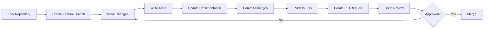

# Contributing to Grantha

We welcome contributions to Grantha! This guide will help you understand how to contribute effectively to the project.

## Table of Contents

- [Getting Started](#getting-started)
- [How to Contribute](#how-to-contribute)
- [Development Process](#development-process)
- [Code Standards](#code-standards)
- [Testing Guidelines](#testing-guidelines)
- [Documentation](#documentation)
- [Pull Request Process](#pull-request-process)
- [Issue Guidelines](#issue-guidelines)
- [Community Guidelines](#community-guidelines)

## Getting Started

### Prerequisites

Before contributing, ensure you have:

- Python 3.12 or higher installed
- Git for version control
- A GitHub account
- Basic understanding of Python, FastAPI, and async programming
- At least one AI provider API key (Google Gemini recommended)

### Setting Up Development Environment

1. **Fork the repository** on GitHub
2. **Clone your fork** locally:
   ```bash
   git clone https://github.com/YOUR_USERNAME/grantha.git
   cd grantha
   ```
3. **Set up the development environment** following the [Development Guide](DEVELOPMENT.md)
4. **Create a feature branch**:
   ```bash
   git checkout -b feature/your-feature-name
   ```

## How to Contribute

### Types of Contributions

We appreciate various types of contributions:

#### 🐛 Bug Fixes
- Fix existing bugs
- Improve error handling
- Resolve performance issues

#### ✨ New Features
- Add new AI provider integrations
- Implement new API endpoints
- Enhance wiki generation capabilities
- Add new research features

#### 📚 Documentation
- Improve API documentation
- Add code examples
- Create tutorials and guides
- Fix documentation errors

#### 🧪 Testing
- Add unit tests
- Improve test coverage
- Add integration tests
- Performance testing

#### 🔧 Infrastructure
- Improve CI/CD pipelines
- Docker configurations
- Deployment improvements
- Monitoring and logging enhancements

### What We're Looking For

Priority areas for contributions:

1. **Additional AI Provider Support**
   - Anthropic Claude
   - Cohere
   - Hugging Face Hub
   - Local model integrations

2. **Enhanced Wiki Features**
   - Better content organization
   - Template systems
   - Multi-format exports
   - Collaborative editing

3. **Research Capabilities**
   - Advanced research workflows
   - Better source integration
   - Fact-checking mechanisms
   - Citation management

4. **Performance Improvements**
   - Caching optimizations
   - Async processing enhancements
   - Memory usage optimizations
   - Response time improvements

5. **User Experience**
   - Better error messages
   - Improved API responses
   - Enhanced streaming capabilities
   - Configuration simplification

## Development Process

### Workflow Overview



### Branch Naming Convention

Use descriptive branch names with prefixes:

```bash
# Features
feature/add-anthropic-provider
feature/wiki-templates
feature/streaming-improvements

# Bug fixes
fix/memory-leak-in-cache
fix/error-handling-wiki-generation

# Documentation
docs/api-reference-update
docs/contributing-guide

# Infrastructure
infra/docker-improvements
infra/ci-pipeline-update
```

### Commit Messages

Follow conventional commit format:

```
type(scope): description

[optional body]

[optional footer]
```

**Types:**
- `feat`: New features
- `fix`: Bug fixes
- `docs`: Documentation changes
- `style`: Code style changes
- `refactor`: Code refactoring
- `test`: Test additions/changes
- `chore`: Maintenance tasks

**Examples:**
```bash
feat(providers): add Anthropic Claude support

fix(wiki): resolve memory leak in large repository processing

docs(api): update authentication endpoint documentation

refactor(config): simplify provider configuration loading
```

## Code Standards

### Python Code Style

#### PEP 8 Compliance
- Maximum line length: 88 characters (Black formatter)
- Use 4 spaces for indentation
- Follow PEP 8 naming conventions

#### Type Hints
Always use type hints for function parameters and return values:

```python
from typing import List, Dict, Optional, Union
from pydantic import BaseModel

async def process_wiki_request(
    request: WikiGenerationRequest,
    provider_config: Dict[str, Any]
) -> Optional[WikiStructureModel]:
    """
    Process wiki generation request.
    
    Args:
        request: Wiki generation request with repository info
        provider_config: Configuration for the AI provider
        
    Returns:
        Generated wiki structure or None if processing fails
        
    Raises:
        ValidationError: If request validation fails
        ProviderError: If AI provider returns an error
    """
    # Implementation here
    pass
```

#### Error Handling
Use specific exception types and comprehensive error handling:

```python
from fastapi import HTTPException
import logging

logger = logging.getLogger(__name__)

class WikiGenerationError(Exception):
    """Custom exception for wiki generation errors."""
    pass

async def generate_wiki(request: WikiGenerationRequest):
    try:
        # Validate input
        if not request.repoInfo.owner:
            raise ValueError("Repository owner is required")
        
        # Process request
        result = await process_wiki_generation(request)
        
        if not result:
            raise WikiGenerationError("Failed to generate wiki structure")
        
        return result
        
    except ValueError as e:
        logger.warning(f"Invalid request: {e}")
        raise HTTPException(status_code=400, detail=str(e))
    except WikiGenerationError as e:
        logger.error(f"Wiki generation failed: {e}")
        raise HTTPException(status_code=500, detail=str(e))
    except Exception as e:
        logger.error(f"Unexpected error: {e}", exc_info=True)
        raise HTTPException(status_code=500, detail="Internal server error")
```

#### Async Best Practices
- Use `async`/`await` for I/O operations
- Avoid blocking calls in async functions
- Use `asyncio.gather()` for concurrent operations

```python
import asyncio
from typing import List

async def process_multiple_repositories(
    repos: List[str]
) -> List[WikiStructureModel]:
    """Process multiple repositories concurrently."""
    tasks = [process_single_repository(repo) for repo in repos]
    results = await asyncio.gather(*tasks, return_exceptions=True)
    
    # Filter out exceptions and return successful results
    return [r for r in results if isinstance(r, WikiStructureModel)]
```

### API Design Guidelines

#### Endpoint Naming
- Use descriptive, resource-based URLs
- Follow REST conventions
- Use plural nouns for collections

```python
# Good
@app.get("/api/wikis")
@app.post("/api/wikis")
@app.get("/api/wikis/{wiki_id}")
@app.put("/api/wikis/{wiki_id}")
@app.delete("/api/wikis/{wiki_id}")

# Avoid
@app.get("/api/getWikis")
@app.post("/api/createWiki")
```

#### Request/Response Models
Always use Pydantic models for request and response validation:

```python
from pydantic import BaseModel, Field
from typing import List, Optional
from datetime import datetime

class WikiGenerationRequest(BaseModel):
    """Request model for wiki generation."""
    repoInfo: RepoInfo
    language: str = Field(default="en", description="Target language code")
    provider: str = Field(default="google", description="AI provider to use")
    model: Optional[str] = Field(None, description="Specific model to use")
    
    class Config:
        json_schema_extra = {
            "example": {
                "repoInfo": {
                    "owner": "username",
                    "repo": "repository",
                    "type": "github"
                },
                "language": "en",
                "provider": "google"
            }
        }

class WikiGenerationResponse(BaseModel):
    """Response model for wiki generation."""
    wiki_id: str
    status: str
    created_at: datetime
    structure: Optional[WikiStructureModel] = None
    
    class Config:
        json_encoders = {
            datetime: lambda dt: dt.isoformat()
        }
```

## Testing Guidelines

### Testing Structure

```
tests/
├── unit/                   # Unit tests
│   ├── test_config.py
│   ├── test_wiki_generator.py
│   └── test_clients/
│       ├── test_openai_client.py
│       └── test_google_client.py
├── integration/            # Integration tests
│   ├── test_api_endpoints.py
│   └── test_wiki_generation.py
├── fixtures/              # Test data
│   ├── sample_repos/
│   └── mock_responses/
└── conftest.py            # Test configuration
```

### Writing Tests

#### Unit Tests
```python
import pytest
from unittest.mock import AsyncMock, patch
from api.wiki_generator import WikiGenerator
from api.config import get_model_config

class TestWikiGenerator:
    @pytest.fixture
    def wiki_generator(self):
        return WikiGenerator()
    
    @pytest.fixture
    def sample_repo_info(self):
        return {
            "owner": "testuser",
            "repo": "testrepo",
            "type": "github"
        }
    
    @pytest.mark.asyncio
    async def test_generate_wiki_structure(self, wiki_generator, sample_repo_info):
        """Test basic wiki structure generation."""
        with patch('api.wiki_generator.analyze_repository') as mock_analyze:
            mock_analyze.return_value = {"files": ["README.md"]}
            
            result = await wiki_generator.generate(sample_repo_info)
            
            assert result is not None
            assert result.title is not None
            assert len(result.pages) > 0
            mock_analyze.assert_called_once()
    
    @pytest.mark.asyncio
    async def test_generate_wiki_invalid_repo(self, wiki_generator):
        """Test error handling for invalid repository."""
        invalid_repo = {"owner": "", "repo": "", "type": "github"}
        
        with pytest.raises(ValueError, match="Repository owner is required"):
            await wiki_generator.generate(invalid_repo)
```

#### Integration Tests
```python
from fastapi.testclient import TestClient
from api.api import app

client = TestClient(app)

class TestWikiAPI:
    def test_health_check(self):
        """Test health check endpoint."""
        response = client.get("/health")
        assert response.status_code == 200
        assert response.json()["status"] == "healthy"
    
    def test_wiki_generation_valid_request(self):
        """Test wiki generation with valid request."""
        request_data = {
            "repoInfo": {
                "owner": "testuser",
                "repo": "testrepo",
                "type": "github"
            },
            "language": "en"
        }
        
        response = client.post("/api/wiki/generate", json=request_data)
        
        assert response.status_code == 200
        data = response.json()
        assert "id" in data
        assert "title" in data
        assert "pages" in data
    
    def test_wiki_generation_invalid_request(self):
        """Test wiki generation with invalid request."""
        request_data = {"invalid": "data"}
        
        response = client.post("/api/wiki/generate", json=request_data)
        assert response.status_code == 422
```

### Test Coverage

Maintain high test coverage:
- Aim for 80%+ overall coverage
- 90%+ coverage for critical paths
- 100% coverage for security-related code

```bash
# Run tests with coverage
pytest --cov=api --cov-report=html --cov-report=term

# View coverage report
open htmlcov/index.html
```

### Mock AI Providers

Create mocks for AI providers to avoid API costs during testing:

```python
# tests/mocks/mock_providers.py
class MockGoogleClient:
    async def complete(self, messages, **kwargs):
        return "Mock response for: " + str(messages[-1]["content"])
    
    async def stream_complete(self, messages, **kwargs):
        async def mock_stream():
            words = "Mock streaming response".split()
            for word in words:
                yield word + " "
        return mock_stream()

# In test files
@patch('api.config.GoogleGenAIClient', MockGoogleClient)
async def test_with_mock_provider():
    # Test implementation
    pass
```

## Documentation

### Code Documentation

#### Docstrings
Use Google-style docstrings for all public functions and classes:

```python
class WikiGenerator:
    """
    Generates comprehensive wiki structures from repository analysis.
    
    This class handles the entire wiki generation pipeline, from repository
    analysis to content generation using various AI providers.
    
    Attributes:
        config (dict): Configuration settings for wiki generation
        provider_client: AI provider client instance
        
    Example:
        >>> generator = WikiGenerator()
        >>> wiki = await generator.generate(repo_info)
        >>> print(wiki.title)
    """
    
    async def generate(
        self, 
        repo_info: Dict[str, Any], 
        language: str = "en",
        provider: str = "google"
    ) -> WikiStructureModel:
        """
        Generate wiki structure from repository information.
        
        Args:
            repo_info (Dict[str, Any]): Repository information including
                owner, repo name, and type
            language (str, optional): Target language for content generation.
                Defaults to "en"
            provider (str, optional): AI provider to use. Defaults to "google"
            
        Returns:
            WikiStructureModel: Complete wiki structure with pages and sections
            
        Raises:
            ValueError: If repository information is invalid
            ProviderError: If AI provider fails to generate content
            
        Example:
            >>> repo_info = {"owner": "user", "repo": "project", "type": "github"}
            >>> wiki = await generator.generate(repo_info, language="ja")
            >>> print(len(wiki.pages))
        """
        # Implementation
        pass
```

### API Documentation

Update API documentation when adding new endpoints:

1. **Update docstrings** in endpoint functions
2. **Add examples** to Pydantic models
3. **Update API_REFERENCE.md** with new endpoints
4. **Add usage examples** in appropriate documentation

### README Updates

When adding significant features:
1. Update feature list in main README.md
2. Add configuration examples if needed
3. Update quick start guide if necessary

## Pull Request Process

### Before Submitting

1. **Run tests locally**:
   ```bash
   pytest -v --cov=api
   ```

2. **Check code formatting**:
   ```bash
   black api/ tests/
   isort api/ tests/
   ```

3. **Run linting**:
   ```bash
   flake8 api/ tests/
   mypy api/
   ```

4. **Update documentation** if needed

### Pull Request Template

Use this template for your pull request:

```markdown
## Description

Brief description of changes made.

## Type of Change

- [ ] Bug fix (non-breaking change that fixes an issue)
- [ ] New feature (non-breaking change that adds functionality)
- [ ] Breaking change (fix or feature that would cause existing functionality to not work as expected)
- [ ] Documentation update

## How Has This Been Tested?

- [ ] Unit tests
- [ ] Integration tests
- [ ] Manual testing

## Testing Details

Describe the tests you ran and how to reproduce them.

## Checklist

- [ ] Code follows the style guidelines
- [ ] Self-review completed
- [ ] Code is commented, particularly in hard-to-understand areas
- [ ] Documentation updated
- [ ] Tests added/updated
- [ ] All tests pass
- [ ] No breaking changes or breaking changes are documented

## Screenshots (if applicable)

Add screenshots for UI changes.

## Additional Notes

Any additional information that reviewers should know.
```

### Review Process

1. **Automated checks** must pass
2. **Code review** by maintainers
3. **Testing verification** 
4. **Documentation review**
5. **Final approval** and merge

### Addressing Review Comments

- Respond to all review comments
- Make requested changes promptly
- Update tests if needed
- Request re-review when ready

## Issue Guidelines

### Reporting Bugs

Use the bug report template:

```markdown
**Bug Description**
A clear description of the bug.

**To Reproduce**
Steps to reproduce the behavior:
1. Go to '...'
2. Click on '....'
3. Scroll down to '....'
4. See error

**Expected Behavior**
What you expected to happen.

**Screenshots**
If applicable, add screenshots.

**Environment:**
 - OS: [e.g. iOS]
 - Python Version: [e.g. 3.12]
 - Grantha Version: [e.g. 1.0.0]

**Additional Context**
Any other context about the problem.
```

### Feature Requests

Use the feature request template:

```markdown
**Is your feature request related to a problem?**
A clear description of what the problem is.

**Describe the solution you'd like**
A clear description of what you want to happen.

**Describe alternatives you've considered**
Other solutions or features you've considered.

**Additional context**
Any other context or screenshots about the feature request.
```

### Issue Labels

Use appropriate labels:
- `bug`: Something isn't working
- `enhancement`: New feature or request
- `documentation`: Documentation improvements
- `good first issue`: Good for newcomers
- `help wanted`: Extra attention needed
- `priority:high`: High priority issue
- `provider:specific`: Provider-specific issue

## Community Guidelines

### Code of Conduct

We are committed to providing a welcoming and inspiring community for all. Please follow our Code of Conduct:

1. **Be respectful** and inclusive
2. **Be collaborative** and helpful  
3. **Be mindful** of your language and actions
4. **Be patient** with newcomers and questions
5. **Be constructive** in feedback and criticism

### Communication

- **GitHub Issues**: Bug reports and feature requests
- **GitHub Discussions**: Questions and general discussion
- **Pull Requests**: Code review and development discussion

### Recognition

We recognize contributors through:
- Contributor acknowledgments in releases
- GitHub contributor listings
- Special recognition for significant contributions

## Getting Help

If you need help with contributing:

1. **Check existing documentation** and issues
2. **Ask questions** in GitHub discussions
3. **Reach out** to maintainers if needed

## License

By contributing to Grantha, you agree that your contributions will be licensed under the same license as the project.

---

Thank you for contributing to Grantha! Your efforts help make this project better for everyone.